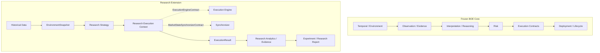

# QuantForge

QuantForge is a **Scientific Operating System for Market Research and Behavioral Trading**. Its primary objective is to repeatedly convert statistically validated market behavior into profitable automated trading systems through a disciplined, reproducible research-to-deployment pipeline.

QuantForge is not designed to be a generic trading bot or indicator collection. It exists to enforce a strict boundary between market reality, scientific validation, and execution logic. By treating trading systems as byproducts of validated research rather than the goal itself, QuantForge builds a compounding body of scientific market knowledge.

---

## Project Status

| Area                       | Status                                              |
| -------------------------- | --------------------------------------------------- |
| BOE Core                   | Frozen                                              |
| Temporal/Environment Model | Frozen                                              |
| Execution Contracts        | Frozen                                              |
| Lifecycle/Evidence         | Frozen                                              |
| Experiment Orchestration   | Implemented (V1)                                    |
| Research Execution         | Implemented                                         |
| Operational Governance     | Frozen                                              |
| Dataset Foundation         | Not yet integrated                                  |
| Walk-forward               | Not ready                                           |
| Optimization               | Deliberately deferred                               |
| Live Integration           | Separate operational boundary                       |

---

## Architecture

QuantForge enforces a strict downward-only flow of information from Market Reality to Operational Reality. 



---

## Frozen Architectural Boundaries

QuantForge enforces extreme architectural discipline to preserve the integrity of the scientific operating system. The following boundaries are strictly **FROZEN**:

* `boe/execution/`
* `boe/deployment/`
* `boe/temporal/`
* `research/lifecycle/`
* `research/experiment_recorder.py`

These areas represent the fundamental truth of the system (execution logic, temporal progression, and lifecycle). By freezing these boundaries, we guarantee that future research modules, new brokers, and alternative strategies can be injected into the system without risk of corrupting the deterministic core.

---

## Research Architecture

The research subsystem is isolated from the live deployment infrastructure. A fundamental principle of QuantForge is:

> **Research simulation requires an execution engine PLUS an explicit market-state synchronization capability.**

The research architecture utilizes:
* `EnvironmentSnapshot`: Represents an immutable tick or bar.
* `HistoricalMarketAdapter`: Translates raw historical ticks into canonical snapshots.
* `ResearchStrategyContract`: A deterministic, causal rule set evaluating snapshots.
* `ResearchExecutionContext`: A dataclass bundling a generic `ExecutionEngineContract` and a simulation-specific `MarketStateSynchronizerContract`.
* `ResearchRunEngine`: Evaluates the strategy sequentially, explicitly syncing the market state prior to dispatch.

This synchronization capability belongs explicitly in the research layer. Live execution engines do not need synthetic market state synchronization because real exchanges provide it. Isolating this synchronization allows the frozen `ExecutionEngineContract` to remain structurally unaware of simulation mechanics.

---

## Experiment Orchestration

Experiment Orchestration V1 is currently implemented. It provides a strict configuration-driven execution loop capable of parameter sweeps without mutating the frozen execution layer.

### Implemented
* **Hypothesis/Configuration**: Experiments defined by a strict configuration payload.
* **Experiment Matrix**: Generates execution runs via Cartesian product with validation filters.
* **Experiment Identity**: Experiment ID is derived exclusively from a SHA256 content hash of the configuration parameters, guaranteeing reproducibility.
* **Configuration Isolation**: Fresh strategy and execution instances are created for every single iteration.
* **Run Execution & Validation**: Out-of-sample data (`VALIDATION`, `TEST`) is strictly fenced from in-sample (`TRAIN`) parameter generation.
* **Aggregation/Reporting**: Matrix outcomes tabulated into DataFrame formats.

### Not yet ready
* Walk-forward optimization.
* Automatic parameter selection or machine learning tuning.
* In-memory dataset caching.
* Parallel / threaded execution.

---

## Data and Evidence

Scientific reproducibility requires durable evidence provenance. 

* **Experiment Provenance**: Experiment configurations are cryptographically hashed for unique reproducible identity.
* **Dataset Partitions**: `TRAIN`, `VALIDATION`, and `TEST` partitions are defined API concepts enforced by the orchestration engine.
* **Execution Evidence**: Complete `ExecutionResult` structures are produced deterministically during research simulation.

**Note**: Dataset/evidence infrastructure (such as `DatasetManifest` and Partition Readers) is a planned research foundation and should **not** currently be interpreted as an enforced scientific data-access boundary. These are not yet integrated into orchestration.

---

## Scientific / Research Safety

QuantForge aims to be statistically impenetrable to common quantitative development fallacies. 

* **Temporal Ordering**: Strictly enforced.
* **No Look-Ahead**: Enforced by the frozen temporal/execution engine.
* **Explicit Market State**: Mark-To-Market occurs deterministically before strategy execution.
* **Separation of Partitions**: Implemented in Orchestration API.
* **Reproducible Experiment Identity**: Enforced via configuration content hashes.

---

## Live / Deployment Separation

Research orchestration is entirely separated from live deployment. A strategy deployed to the live market transitions to the **Operational Governance** domain (Phase 9).

QuantForge separates:
* **Research / Historical Simulation**
* **Paper / Live / Broker / Deployment**

Research infrastructure cannot implicitly invoke live broker connectivity. The `OperationalAuthorization` fact provides a permanent, auditable human-authorized linkage between a validated `StrategyManifest` and its runtime deployment identity. 

---

## Testing

QuantForge maintains a robust regression testing suite guaranteeing temporal, scientific, and execution correctness.

**Current Test Count**: ~539 deterministic unit/integration tests.  
**Framework**: `pytest`

### Running the tests:
```powershell
$env:PYTHONPATH="."
pytest tests/ -q
```

---

## Development Philosophy

* **Freeze Stable Scientific Contracts**: Core components (BOE) are frozen. We extend via new implementations, we do not mutate.
* **Explicit Boundaries**: Separation of concerns is paramount (e.g. Interpretation vs Decision vs Risk vs Execution).
* **Reproducibility Before Scalability**: Determinism is non-negotiable.
* **Evidence Before Conclusions**: Analytics and data tell the story, not the engine.
* **Do Not Confuse Tests with Production Proof**: Tests prove the contracts; the Deployment layer proves production viability.

---

## Current Roadmap

### Completed / Frozen
* Phases 1–5: Scientific Runtime (Observation, Reasoning, Risk, Execution Contracts)
* Phase 6: Scientific Validation
* Phase 7: Research Deployment Assembly
* Phase 8: Research Industrialization
* Phase 9: Operational Governance (Sprint 9.1 Frozen)

### Current / In Progress
* Dataset Foundation integration
* Research Analytics Reconciliation

### Deliberately Deferred
* Automatic parameter optimization
* Live broker runtime APIs

---

## Repository Structure

```text
QuantForge/
├── boe/
│   ├── deployment/
│   ├── execution/
│   ├── risk/
│   └── temporal/
├── docs/
├── operational_governance/
├── research/
│   ├── analytics/
│   ├── engine/
│   ├── lifecycle/
│   └── orchestration/
└── tests/
```

---

## Documentation Links

* [Architecture Document](docs/ARCHITECTURE.md)
* [Project Context](docs/CONTEXT.md)
* [Development Roadmap](docs/ROADMAP.md)
* [Changelog](docs/CHANGELOG.md)
* [Experiment Orchestration V1 ADR](docs/EXPERIMENT_ORCHESTRATION_V1_ADR.md)
* [Sprint 9.1 Permanent Freeze](docs/SPRINT9_1_PERMANENT_FREEZE.md)
